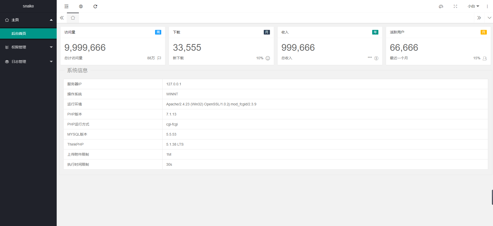
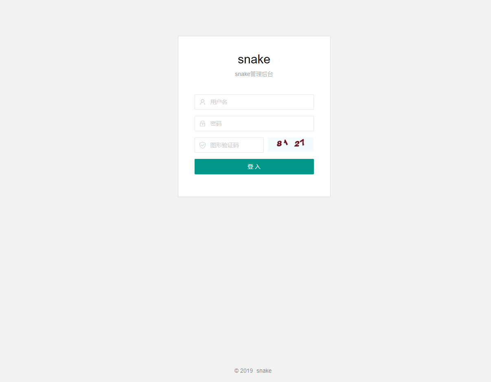
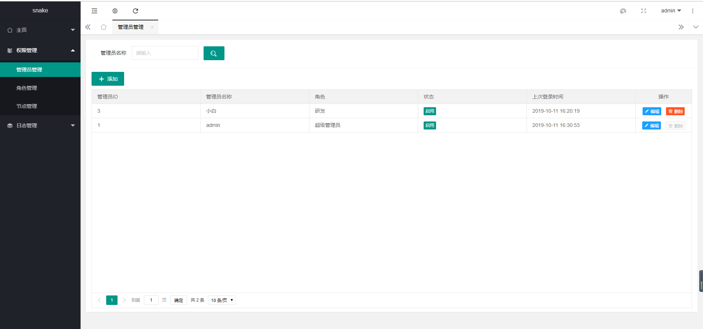
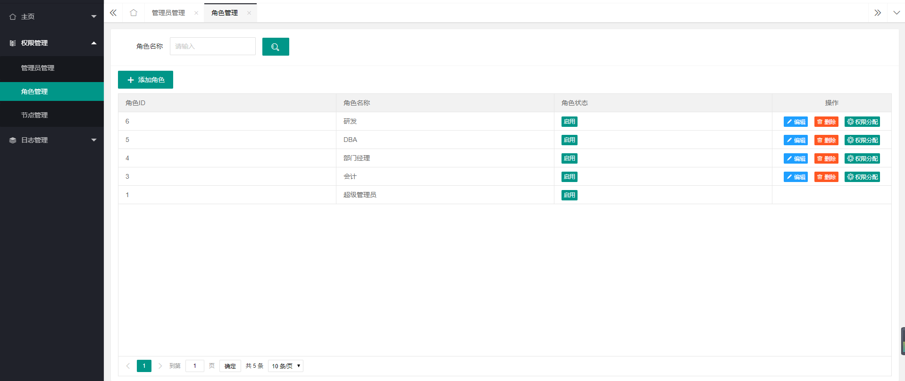
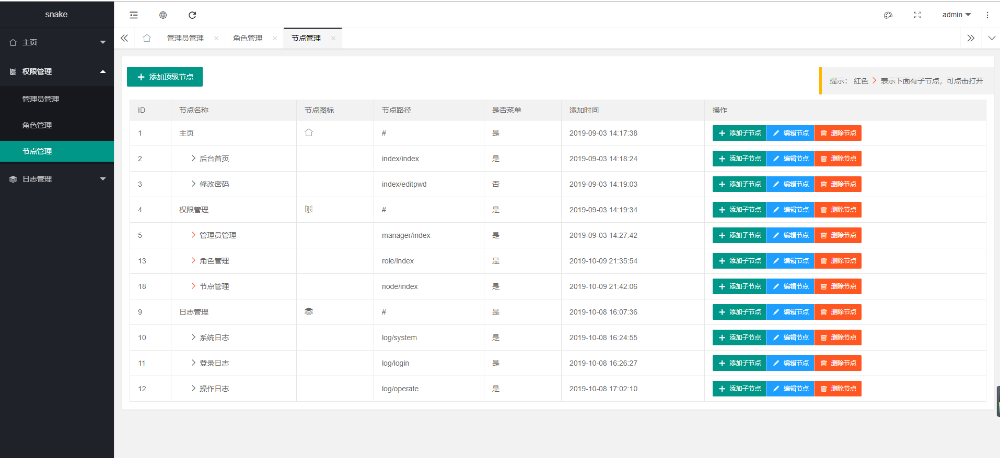
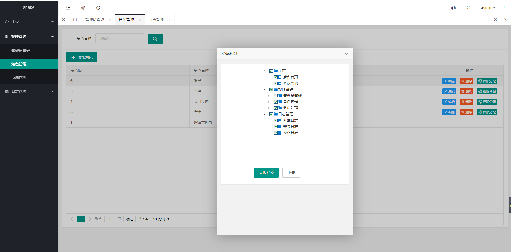
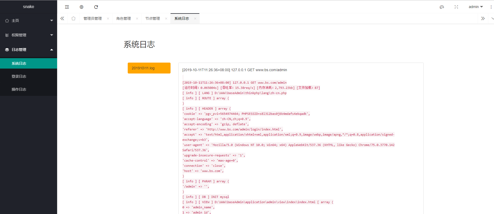
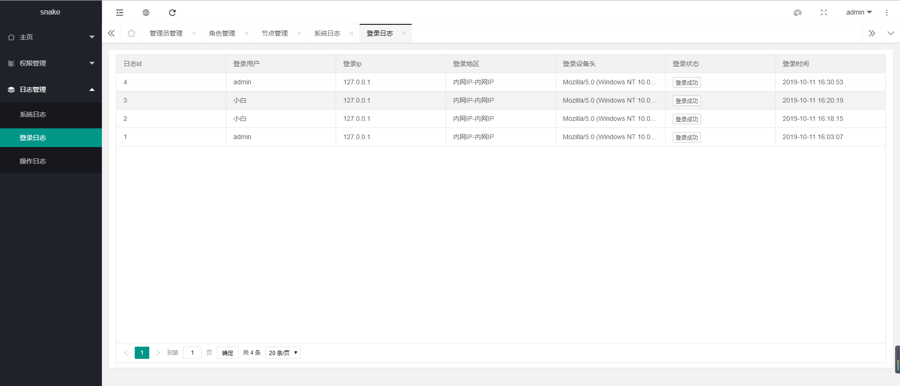
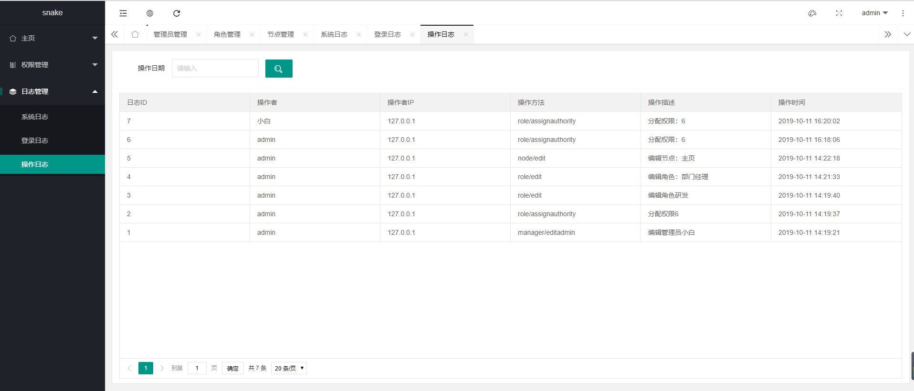

# snake
thinkphp5.1 + layui 实现的带rbac的基础管理后台，方便快速开发法使用

基于 thinkphp5.0 的snake 可以到 https://github.com/nick-bai/snake/releases/tag/v1.0 下载

# 一睹为快
 

 

 

 

 

 

 

 

 

# QQ交流群
## 926671726 

# 如何搭建
1、下载源码   
2、搭建可以参考我的 whisper 搭建手册  
https://www.kancloud.cn/nickbai/whisper-v2/988777

> 百度 thinkphp5.1 搭建，你会获得很多的有效信息。或者加群讨论。
3、访问 你配置的域名/admin 即可进入后台

# 打赏作者  
支付宝
  
微信
 
